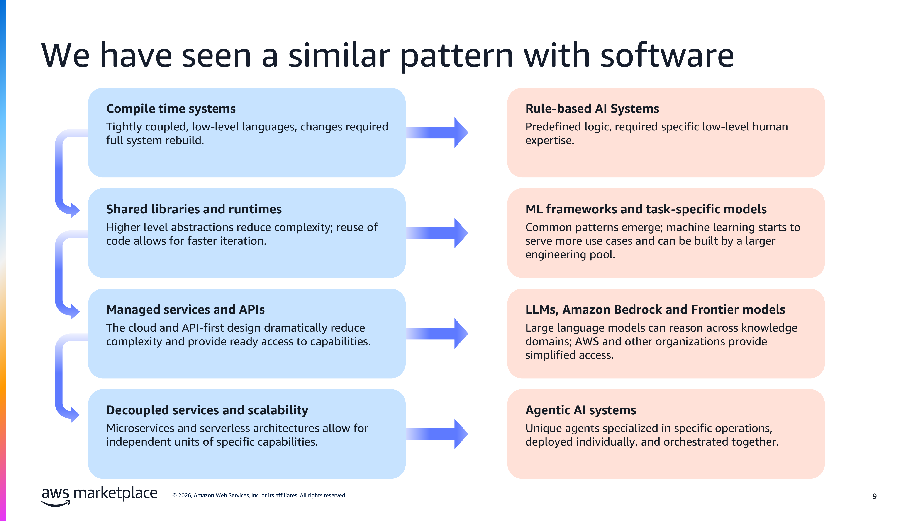
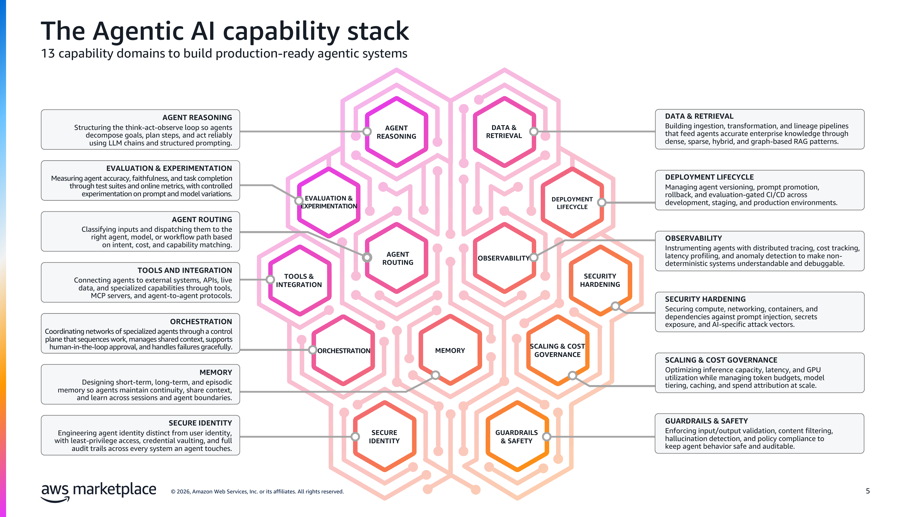

# Episode 1: AI Foundations for SRE & DevOps

> **Sagar Utekar** | CNCF Ambassador | Kubestronaut

<!-- [Watch on YouTube](https://youtube.com/...) -->

---

## What You'll Learn

By the end of this episode, you'll have ONE mental model that makes every AI tool, agent, and buzzword slot into place — plus your first working API call to Claude with SRE context.

| Concept | One-Line Summary |
|---------|-----------------|
| The Payload Shift | Alerts moved from human dashboards to AI agents. Same infra, new destination. |
| Traditional AI vs Generative AI | Prediction (you already use `predict_linear()`) vs Creation (generate manifests) |
| Software Evolution Parallel | Waterfall → Agile → DevOps → AI-Assisted — each era removed one constraint |
| How LLMs Work | Training data = Docker layers. Weights = image. Inference = running the container. |
| Context Engineering | 5 things compete for the context window — the #1 skill for building agents |
| Agents = Brain + Hands + Loop | LLM (brain) + Tools (hands) + Reasoning Loop (autonomy) |
| MCP & A2A | Universal adapter for tools (MCP) and agent-to-agent communication (A2A) |
| When Agents Fail | High variability = good fit. Deterministic workflows = use a bash script. |

---

## The Payload Shift — The One Framework You Need

This is the single most important concept in the entire series. Everything builds on this.

```
BEFORE (Traditional SRE)                    AFTER (AI-Augmented SRE)

Alert fires                                 Alert fires
    |                                           |
Dashboard → Human reads                     LLM receives alert payload
    |                                           |
Human runs kubectl                          LLM runs kubectl (via tools)
    |                                           |
Human diagnoses                             LLM reasons about root cause
    |                                           |
Human applies fix                           LLM applies fix (with guardrails)
    |                                           |
Human writes postmortem at 4 PM             LLM generates postmortem immediately

The PAYLOAD destination shifted             Same infra. New destination.
from human dashboards to AI agents.         That is the only change.
```

---

## The AI Timeline — Each Era Removed a Constraint

Every era of AI removed one constraint. Understanding this helps you see where agents fit — and why 2025 is different.


> *Source: AWS — "Building Agentic Systems" Workshop, 2026*

| Era | Constraint Removed | DevOps Example |
|-----|-------------------|----------------|
| Traditional ML (2010-2019) | Manual threshold tuning | `predict_linear()` in Prometheus |
| Large Language Models (2020-2022) | Structured query requirements | "Show me pods that restarted 3+ times" — no PromQL needed |
| Generative AI (2023-2024) | Writing everything from scratch | Generate Terraform, Dockerfiles, runbooks in seconds |
| Agentic AI (2025+) | Human execution speed | Detect → diagnose → fix → verify → report — autonomously |

---

## Software and AI Evolved in Parallel

This is a pattern most people miss. Software delivery and AI followed the same arc — from tightly coupled to specialized and composable. Microservices = specialized agents.


> *Source: AWS — "Building Agentic Systems" Workshop, 2026*

---

## GenAI vs Agentic AI — Two Fundamentally Different Patterns

This is the most important distinction in AI for DevOps today.


> *Source: AWS — "Building Agentic Systems" Workshop, 2026*

| | Generative AI | Agentic AI |
|---|---|---|
| **Analogy** | Stack Overflow | Your senior SRE on-call |
| **Behavior** | "Here's a Terraform file" | Writes, plans, applies, and verifies the Terraform |
| **K8s example** | "The pod is OOMKilled" | Detects OOM → patches deployment → confirms fix |
| **State** | Stateless — one prompt, one response | Stateful — multi-step reasoning with memory |
| **Tools** | None | kubectl, APIs, logs, Slack |

---

## Context Engineering — The #1 Skill for Building Agents

The context window is NOT just where you put your prompt. Five different things compete for space inside it. Managing this is context engineering — and it's what separates good agents from bad ones.


> *Source: AWS — "Building Agentic Systems" Workshop, 2026*

| Component | What It Is |
|-----------|-----------|
| System Prompt | Agent persona and foundational instructions |
| Past Context | Conversation history — current + relevant past sessions |
| Tool Definitions | What tools can the agent use? MCP servers, functions, APIs |
| Retrieved Memory | Knowledge from external systems via RAG, runbooks, docs |
| Tool Outputs | Results from tools the agent already called this session |

---

## The 13-Domain Capability Stack

Most tutorials cover domain 1 (reasoning) and stop. This series covers 10 of 13 domains across 14 episodes.


> *Source: AWS — "Building Agentic Systems" Workshop, 2026*

| # | Domain | What It Covers | This Series |
|---|--------|---------------|-------------|
| 1 | Agent Reasoning | The think-act-observe loop | Episode 4 |
| 2 | Tools & Integration | MCP, APIs, kubectl | Episode 4 |
| 3 | Orchestration | Multi-agent coordination | Episode 11 |
| 4 | Memory | Short-term + long-term | Episode 6 |
| 5 | Data & Retrieval | RAG, knowledge bases | Episode 10 |
| 6 | Agent Routing | Intent → right agent | Episode 11 |
| 7 | Guardrails & Safety | Input/output validation | Episodes 4-5 |
| 8 | Security Hardening | Prompt injection defense | Episode 9 |
| 9 | Secure Identity | Agent identity ≠ user identity | — |
| 10 | Observability | Tracing, cost tracking | Episode 11 |
| 11 | Evaluation | Accuracy, faithfulness testing | — |
| 12 | Deployment Lifecycle | Versioning, rollback, CI/CD | Episode 8 |
| 13 | Scaling & Cost | Token budgets, model tiering | Episode 13 |

---

## Try It Yourself

### Prerequisites

```bash
export ANTHROPIC_API_KEY="your-key-here"   # Get from console.anthropic.com
pip install anthropic
```

### Demo: Your First SRE-Aware API Call

```bash
python3 demos/first_api_call.py
```

Send a real Kubernetes alert to Claude with an SRE system prompt. Notice how the system prompt — `"You are a senior SRE with 10 years of Kubernetes experience"` — changes everything about the response. Without it, you get generic advice. With it, you get production-grade remediation steps with specific `kubectl` commands.

```python
import anthropic

client = anthropic.Anthropic()

message = client.messages.create(
    model="claude-sonnet-4-6-latest",
    max_tokens=1024,
    system="You are a senior SRE with 10 years of Kubernetes experience. Be concise and actionable.",
    messages=[
        {
            "role": "user",
            "content": """Analyze this alert and give me a 3-step remediation plan:

ALERT: PodCrashLooping
Namespace: production
Pod: api-server-7d4f8b6c5-x2k9m
Restarts: 15 in last 30 minutes
Last Log: "fatal error: runtime: out of memory"
Current Memory Limit: 256Mi
Current Memory Usage: 255Mi (99.6%)"""
        }
    ]
)

print(message.content[0].text)
```

**No API key?** Run it free with Ollama:

```bash
ollama run llama3.2:3b "You are a senior SRE. A pod named api-server has restarted 15 times. Last log: 'out of memory'. Memory limit 256Mi, usage 255Mi. Give a 3-step fix."
```

**Checkpoint:** You should see a structured remediation plan mentioning memory limits and OOM. If you get a 401 error → your API key isn't set. If `ModuleNotFoundError` → run `pip install anthropic`.

---

## Quick Reference

### MCP vs A2A

| | MCP (Model Context Protocol) | A2A (Agent-to-Agent) |
|---|---|---|
| **Connects** | Agents ↔ Tools & Data | Agents ↔ Other Agents |
| **Analogy** | USB-C port | HTTP between microservices |
| **When needed** | Single agent using tools | Multi-agent systems |

### Agent Adoption Maturity

| Stage | The Agent... | Human Role | This Series |
|-------|-------------|------------|-------------|
| Assist (low risk) | Helps human decide | In the loop on every action | Episodes 1-5 |
| Automate (medium risk) | Executes within guardrails | Reviews at checkpoints | Episodes 6-10 |
| Orchestrate (managed risk) | Coordinates across systems | Monitors, not in the middle | Episode 11 |

---

## AI Landscape for DevOps (2025-2026)

### AI Assistants (question → answer)

| Name | By |
|------|-----|
| ChatGPT | OpenAI |
| Claude | Anthropic |
| Gemini | Google |
| Copilot | Microsoft |
| Meta AI | Meta |
| Perplexity | Perplexity AI |
| Le Chat | Mistral |

### AI Agents (goal → autonomous execution)

| Name | By | Specialty |
|------|-----|-----------|
| Kiro | AWS | Dev workflows, AWS, coding |
| GitHub Copilot Agent | GitHub/Microsoft | Coding, PRs, repo tasks |
| Cursor | Cursor | Agentic code editing |
| Devin | Cognition | Autonomous software engineering |
| Claude Code | Anthropic | Terminal coding agent |
| Gemini Code Assist | Google | Coding, GCP tasks |
| Docker Gordon | Docker | Container workflows |
| Replit Agent | Replit | Build & deploy apps |

### Kubernetes / Cloud Native AI Agents

| Name | By | Specialty |
|------|-----|-----------|
| kagent | Solo.io / CNCF Sandbox | Kubernetes-native agents via CRDs |
| K8sGPT | CNCF Sandbox | Cluster scanning & issue explanation |
| Robusta AI | Robusta | Incident investigation, alerting |
| Botkube | Botkube | ChatOps for K8s (Slack/Teams) |

---

## Cost

This entire episode costs **~$0.02** (one Claude Sonnet API call). Ollama demos are free.

---

## Files

| File | What It Does |
|------|-------------|
| [`demos/first_api_call.py`](demos/first_api_call.py) | Your first SRE-aware Claude API call |

---

## What's Next

**Episode 2: Local & Remote LLMs** — Set up Ollama for free local inference, Claude API for cloud, and AWS Bedrock for enterprise. Three backends, one agent framework.

<!-- [Watch Episode 2 →](../episode-2-llms-local-remote/) -->
