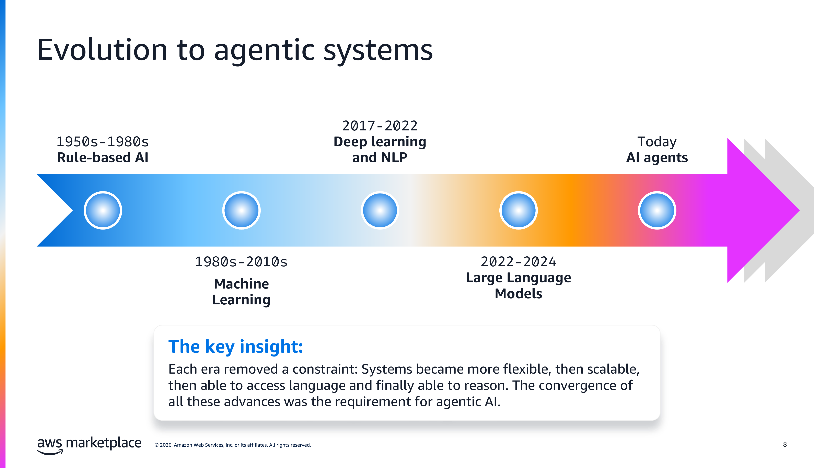
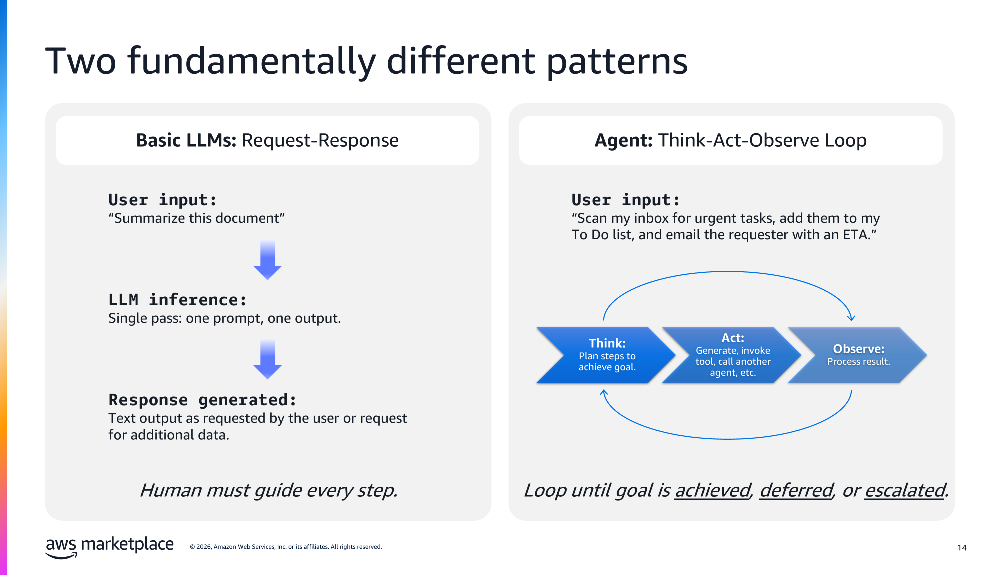
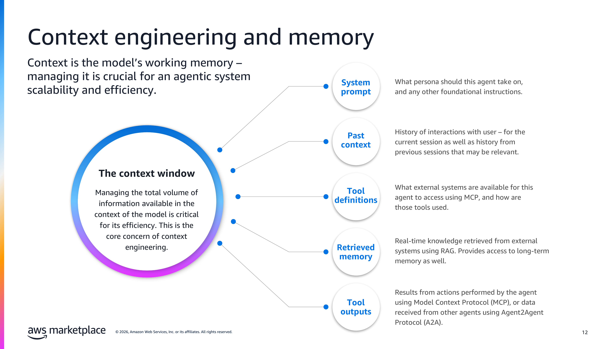

# Episode 1: AI Foundations for SRE & DevOps

> **Sagar Utekar** | CNCF Ambassador | Kubestronaut

<!-- [Watch on YouTube](https://youtube.com/...) -->

---

## What You'll Learn

By the end of this episode, you'll understand how AI evolved from static rules to autonomous agents, what's inside an agent, and you'll make your first API call to Claude with SRE context.

| Concept | One-Line Summary |
|---------|-----------------|
| AI Evolution | Rule-based → ML → Deep Learning → LLMs → Agents. Same arc as infra: monolith → microservices. |
| LLMs vs Agents | LLMs respond with information. Agents act toward a goal — tools, loops, memory. |
| Agent Internals | Agent = code. Model (reasoning) + Tools (acting) + Loop (connecting the two). |
| Context Engineering | Everything competes for the context window — the #1 skill for building agents. |
| RAG & Embeddings | Retrieval-Augmented Generation lets agents use YOUR data — runbooks, incidents, docs. |
| Guardrails & Sandboxes | Admission controllers for AI — input/output filters + isolated execution environments. |
| MCP & A2A | Standard protocols: MCP connects agents to tools, A2A connects agents to agents. |

---

## How We Got Here — AI Timeline



AI followed the same evolution as infrastructure — tightly coupled → shared libraries → managed services → microservices.

| Era | What Changed | DevOps Parallel |
|-----|-------------|-----------------|
| Rule-Based AI (1950s–1980s) | Humans wrote every rule | Static threshold alerting — "CPU > 80%, page the engineer" |
| Machine Learning (1980s–2010s) | Models learned from data | Anomaly detection — AWS predictive auto-scaling, Datadog |
| Deep Learning & NLP (2017–2022) | Machines understood language | "Show me pods that keep crashing" — no PromQL needed |
| LLMs & GenAI (2022–2024) | Models generate text, code, configs | "Write an HPA that scales on custom Prometheus metrics" |
| AI Agents (2024+) | Models act on systems autonomously | Detect → diagnose → fix → verify → report |

---

## LLMs vs Agents



LLMs have a fundamental limitation — they only know what they learned during training. They can TELL you the kubectl command, but they cannot RUN it. That limitation is exactly why agents exist.

```
WITH LLM:
You paste alert ──► LLM says "increase memory"
YOU open terminal, YOU patch, YOU verify, YOU update Slack

WITH AGENT:
Alert arrives ──► Agent reads logs ──► Agent patches deploy
──► Agent verifies health ──► Agent posts to Slack
YOU sleep through it
```

| LLMs (respond) | Agents (act) |
|---|---|
| "Here's a Terraform file" | Writes, plans, applies, verifies |
| "Increase the memory limit" | Patches deployment, confirms fix |
| One prompt, one response | Loops until done or escalates |
| No access to your systems | Has tools — kubectl, APIs, Slack |

---

## What's Inside an Agent

An agent is code — a Python script, a TypeScript app. Model (reasoning) + Tools (acting) + Loop (connecting the two).

```
┌──────────────────────────────────┐
│          AGENT = CODE            │
│                                  │
│  Model    → reasoning            │
│  Tools    → acting               │
│  Loop     → connecting the two   │
└──────────────────────────────────┘
```

### Key Concepts Covered

| Concept | What It Is |
|---------|-----------|
| Foundation Models | Claude, GPT, Llama, DeepSeek — large general-purpose models you build on |
| Hallucination | Model gives a confident answer that is completely wrong |
| Context Window | Everything the model can see at once — prompt, history, tool defs, results |
| Context Engineering | Managing what goes in and what stays out of the context window |
| RAG | Retrieval-Augmented Generation — lets the model use your data (runbooks, incidents) |
| Embeddings | Numbers representing meaning — "OOMKilled" and "out of memory" are close together |
| Vector Database | Where embeddings are stored — Pinecone, Chroma, Qdrant, Weaviate |
| Agent Skills | Related tools packaged with instructions — e.g., "incident response" skill |
| Think → Act → Observe | The agent loop — reason, invoke a tool, process the result, repeat |
| Agent Memory | Short-term (within a task, context window) + Long-term (across sessions, external store) |
| Guardrails | Input/output filters — admission controllers for AI |
| Sandbox | Isolated environment — agent can only access what you explicitly allow |

### Agents vs Agentic Systems

| Agent (the worker) | Agentic System (the platform) |
|---|---|
| Runs one task | Manages many agents |
| Has tools | Has governance |
| Has a loop | Has observability + access controls |
| **Like a container** | **Like Kubernetes** |

---

## Context Engineering



Five things compete for space in the context window:

| Component | What It Is |
|-----------|-----------|
| System Prompt | Agent persona and foundational instructions |
| Past Context | Conversation history — current + relevant past sessions |
| Tool Definitions | What tools can the agent use? MCP servers, functions, APIs |
| Retrieved Memory | Knowledge from external systems via RAG — runbooks, docs |
| Tool Outputs | Results from tools the agent already called this session |

---

## MCP & A2A

| | MCP (Model Context Protocol) | A2A (Agent-to-Agent) |
|---|---|---|
| **Connects** | Agents ↔ Tools & Data | Agents ↔ Other Agents |
| **Analogy** | REST API for each service | Service mesh between them |
| **Built in** | Episode 4 | Episode 13 |

---

## Try It Yourself

### Prerequisites

```bash
export ANTHROPIC_API_KEY="your-key-here"   # Get from console.anthropic.com
pip install anthropic
```

### Demo: Your First SRE-Aware API Call

```bash
python3 demos/first_api_call.py
```

15 lines of Python, no framework, no tools — see how far a plain LLM gets without tools.

```python
import anthropic

client = anthropic.Anthropic()

message = client.messages.create(
    model="claude-sonnet-4-6-latest",
    max_tokens=1024,
    system="You are a senior SRE with 10 years of Kubernetes experience. Be concise and actionable.",
    messages=[
        {
            "role": "user",
            "content": """Analyze this alert and give me a 3-step remediation plan:

ALERT: PodCrashLooping
Namespace: production
Pod: api-server-7d4f8b6c5-x2k9m
Restarts: 15 in last 30 minutes
Last Log: "fatal error: runtime: out of memory"
Current Memory Limit: 256Mi
Current Memory Usage: 255Mi (99.6%)"""
        }
    ]
)

print(message.content[0].text)
```

The system prompt — `"senior SRE with 10 years of Kubernetes experience"` — shapes everything. Without it, generic advice. With it, your best on-call engineer. Try swapping to "network engineer" or "database admin" for a completely different response.

But this is still request-and-response. Claude is advising, not acting. In Episode 4, we give it tools — and it becomes an agent.

**Checkpoint:** You should see a structured remediation plan mentioning memory limits. `AuthenticationError` = API key not set. `ModuleNotFoundError` = run `pip install anthropic`.

### No API Key? Free Alternatives

**Ollama (local, free):**
```bash
ollama run llama3.2:3b "You are a senior SRE. A pod named api-server has restarted 15 times. Last log: 'out of memory'. Memory limit 256Mi, usage 255Mi. Give a 3-step fix."
```

**Kiro by AWS (free tier):** Open Kiro, paste the same alert, and ask for a remediation plan. We compare all three backends in Episode 2.

---

## The Stack We Build (14 Episodes)

```
┌──────────────────────────────────────────────────────┐
│              AGENTIC SRE PLATFORM                    │
├──────────────────────────────────────────────────────┤
│  CAPSTONE: Multi-Agent Control Plane (Ep 13-14)      │
├─────────────┬────────────┬───────────┬───────────────┤
│ CI/CD       │ Incident   │ IaC       │ Security      │
│ Agent       │ Response   │ Agent     │ Scanner       │
│ (Eps 6-12)  │ (Eps 6-12) │ (Eps 6-12)│ (Eps 6-12)    │
├─────────────┴────────────┴───────────┴───────────────┤
│  MCP LAYER: K8s, Prometheus, GitHub, Terraform (Ep 4)│
├──────────────────────────────────────────────────────┤
│  AGENT FRAMEWORK: Claude Code / Python Agents (Ep 4) │
├──────────────────────────────────────────────────────┤
│  LLM LAYER: Ollama / Claude API / Bedrock (Ep 2)     │
├──────────────────────────────────────────────────────┤
│  YOUR INFRASTRUCTURE: Kubernetes + Observability      │
└──────────────────────────────────────────────────────┘
```

---

## Cost

This entire episode costs **~$0.02** (one Claude Sonnet API call). Ollama and Kiro demos are free.

---

## Files

| File | What It Does |
|------|-------------|
| [`demos/first_api_call.py`](demos/first_api_call.py) | Your first SRE-aware Claude API call |

---

## Homework

- Get your API key from console.anthropic.com or install Ollama
- Run the demo with a different alert
- Change the system prompt and compare the response
- Read [Building Effective AI Agents](https://www.anthropic.com/research/building-effective-agents) by Anthropic

---

## What's Next

**Episode 2: Local & Remote LLMs** — Set up Ollama for free local inference, Claude API for cloud, and AWS Bedrock for enterprise. Three backends, one agent framework.

<!-- [Watch Episode 2 →](../episode-2-llms-local-remote/) -->
